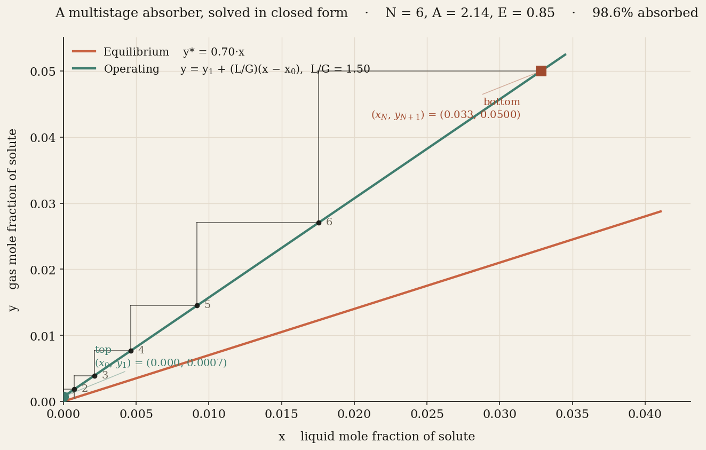

# CounterFlow Neural Network

**Chemical engineering unit operations, written as differentiable PyTorch layers.**

[](https://opensource.org/licenses/MIT)
[](https://www.python.org/downloads/)
[](https://pytorch.org/)
[](https://huggingface.co/spaces/DanielRegaladoCardoso/counterflow-nn)



A small Python library that renders the canonical countercurrent unit operations — gas absorbers, distillation columns, reactor cascades — as trainable neural-network components. The flagship module, **`AbsorptionTower`**, is a physically-exact multistage absorber solved in closed form via Kremser; every parameter (Henry's constant, solvent-to-gas ratio, Murphree plate efficiency) is a learnable PyTorch tensor.

Move the sliders in the [interactive Space](https://huggingface.co/spaces/DanielRegaladoCardoso/counterflow-nn) and watch the McCabe–Thiele diagram redraw itself under exact physics.

---

## Why

Neural networks propagate information in one direction. Chemical towers don't — gas rises, liquid falls, solute transfers continuously across every tray. The equations that govern those systems — mass balance, equilibrium, driving force — are decades-old, closed-form, and exactly what a neural network approximates when you throw enough data at it.

**CFNN does the work up front.** The physics is baked in; the learnable parameters are the thermodynamic constants. Trade a few percentage points of expressiveness on generic classification for interpretable parameters, sample efficiency, and a forward pass that's guaranteed to conserve mass.

## Validation

Four textbook problems, three solvers, same answer. The `AbsorptionTower` module reproduces each reference to better than `10⁻³` relative error.

| example | A = L/(mG) | N | E | absorbed | rel. error |
|---|---|---|---|---|---|
| Treybal 8.2 — acetone / air / water | 1.119 | 6 | 1.00 | 90.06 % | 1.3 × 10⁻⁵ |
| Seader 6.1 — n-butane oil absorber | 2.630 | 8 | 1.00 | 99.97 % | 1.3 × 10⁻⁴ |
| Pinch case (A = 1, β = 1) | 1.000 | 5 | 1.00 | 83.33 % | 8.3 × 10⁻⁶ |
| Real trays, Murphree E = 0.70 | 1.119 | 6 | 0.70 | 84.74 % | 3.1 × 10⁻⁸ |

Reproduce end-to-end in under a second: `python experiments/tier0_physical_validation.py`.

## Install

```bash
git clone https://github.com/DanielRegaladoUMiami/counterflow-nn.git
cd counterflow-nn
pip install -e ".[dev,demo]"
```

## Quick start

```python
import torch
from src.absorption_tower import AbsorptionTower

tower = AbsorptionTower(
    d=4,                  # feature dimension / parallel species
    n_stages=6,           # equilibrium trays
    L_over_G_init=1.5,    # solvent / gas molar ratio
    m_init=0.7,           # Henry's constant
    E_init=0.85,          # Murphree plate efficiency
)

y_feed = torch.rand(batch, 4)       # gas composition at bottom
x_top  = torch.zeros(batch, 4)      # clean solvent at top

y_top, x_bot = tower(y_feed, x_top)          # lean gas · rich liquid
profiles      = tower.profiles(y_feed, x_top) # stage-by-stage, for McCabe–Thiele
```

Full derivation and API in [`docs/AbsorptionTower.md`](docs/AbsorptionTower.md).

## Variants

| variant | inspiration | key feature |
|---|---|---|
| **`AbsorptionTower`** | Gas absorber, exact | Closed-form Kremser solve; learnable physics; textbook-validated |
| **`CounterFlowNetwork`** (CFNN-A) | Absorption tower | Unidirectional transfer, *learned* equilibrium |
| **`DistillationNetwork`** (CFNN-D) | Distillation column | Bidirectional transfer + feed plate + reflux |
| **CFNN-R** *(planned)* | Reactor cascade | CSTR pre/post processing + counterflow core |

`AbsorptionTower` is the physically-exact variant — every scalar has a direct chemical-engineering meaning, and the tower is a single differentiable operation with no internal iteration. `CounterFlowNetwork` (CFNN-A) is the softer variant: counterflow inductive bias, but equilibrium is a learned function rather than `y* = m·x + b`.

## How it works

Two coupled streams flow in opposite directions through N trays. On each tray:

```
Equilibrium          y*ₙ = m · xₙ + b
Murphree efficiency  yₙ   = y_{n+1} + E · (y*ₙ − y_{n+1})
Operating line       y_{n+1} = y₁ + (L/G) · (xₙ − x₀)
```

Substituting gives a linear recurrence `yₙ = β·y_{n+1} + γ·y₁ + δ` that collapses — via Kremser — to a closed form for `y₁`. The whole tower becomes a single differentiable tensor operation. Every physical parameter is learnable; gradients flow back through the solution without a fixed-point iterate in sight.

## ChemE ↔ neural network mapping

| chemical engineering | neural network |
|---|---|
| Gas stream, ascending | Feature stream, forward |
| Liquid stream, descending | Context stream, backward |
| Mass transfer coefficient K_ya | Learnable transfer coefficient α |
| Equilibrium curve y* = f(x) | Learned equilibrium function E(l) (in CFNN-A) or `m·x + b` (in `AbsorptionTower`) |
| Driving force (y − y*) | Stream difference δ = g − E(l) |
| Number of transfer units | Network depth |
| Conservation of mass | Architectural invariant |
| McCabe–Thiele diagram | Visualization of the forward pass |

## Repository layout

```
counterflow-nn/
├── src/
│   ├── absorption_tower.py    AbsorptionTower + AbsorptionNetwork (exact Kremser)
│   ├── plates.py              CounterFlowPlate (learnable CFNN-A)
│   ├── network.py             CounterFlowNetwork (CFNN-A)
│   ├── distillation.py        DistillationPlate + DistillationNetwork (CFNN-D)
│   ├── activations.py         Michaelis–Menten, Arrhenius, Hill, autocatalytic
│   ├── diagnostics.py         Damköhler, Murphree, NTU
│   └── utils.py               Training utilities
├── experiments/
│   ├── tier0_physical_validation.py   AbsorptionTower vs. textbook
│   ├── tier1_absorption_benchmark.py  AbsorptionNetwork vs. MLP
│   ├── tier1_synthetic.py             Moons, circles, XOR
│   ├── tier2_distillation.py          CFNN-D vs. CFNN-A vs. MLP
│   └── tier3_mnist.py                 MNIST / FashionMNIST
├── tests/
│   ├── test_absorption_tower.py       30 physics + gradient tests
│   ├── test_plates.py                 16 tests (CFNN-A)
│   └── test_distillation.py           20 tests (CFNN-D)
├── docs/
│   ├── AbsorptionTower.md             Derivation + API + validation
│   ├── CFNN_Technical_Documentation.md
│   └── CFNN_Execution_Plan.md
├── app.py                      Gradio Space — live McCabe–Thiele
├── CHANGELOG.md
├── requirements.txt
└── pyproject.toml
```

## Running the experiments

```bash
# Under a second, no training — validates against Treybal, Seader.
python experiments/tier0_physical_validation.py

# Phase 1 benchmarks
python experiments/tier1_absorption_benchmark.py
python experiments/tier1_synthetic.py
python experiments/compare_baselines.py

# Phase 2 benchmarks
python experiments/tier2_distillation.py
python experiments/tier3_mnist.py

# Interactive Gradio app — localhost:7860
python app.py
```

## References

- Treybal, R.E. *Mass Transfer Operations*, 3rd ed., McGraw-Hill, 1980 — Ch. 8, Kremser equation
- Seader, J.D., Henley, E.J., Roper, D.K. *Separation Process Principles*, 3rd ed., Wiley, 2011
- Murphree, E.V. *Rectifying column calculations*, Ind. Eng. Chem. 17(7): 747–750, 1925
- Bai, S., Kolter, J.Z., Koltun, V. *Deep Equilibrium Models*, NeurIPS 2019
- Chen, R.T.Q. et al. *Neural Ordinary Differential Equations*, NeurIPS 2018

## Author

**Daniel Regalado Cardoso** — BS Chemical Engineering + MSBA, University of Miami.
[GitHub](https://github.com/DanielRegaladoUMiami) · [Space](https://huggingface.co/spaces/DanielRegaladoCardoso/counterflow-nn)

## License

MIT — see [LICENSE](LICENSE).
